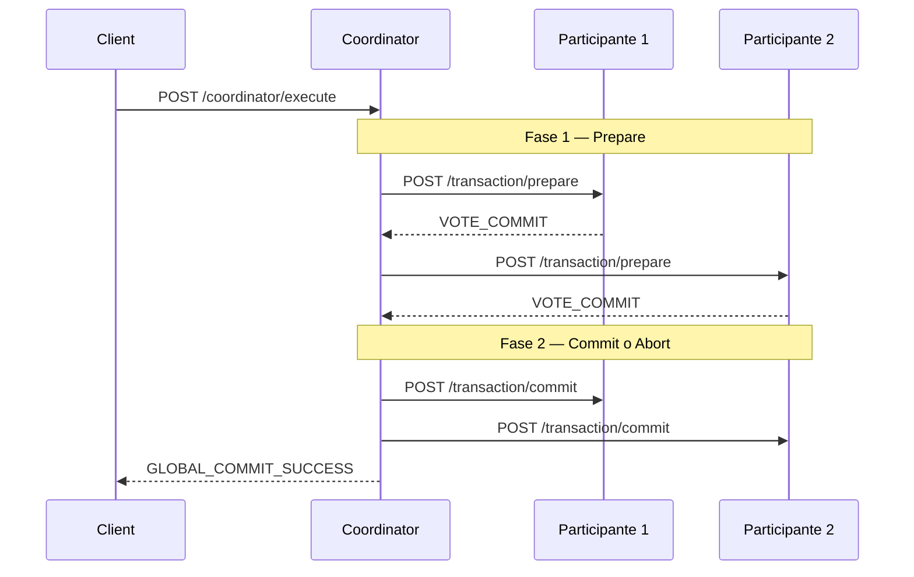

# Two-Phase Commit (2PC)

Implementación educativa del protocolo **Two-Phase Commit** (2PC) con [NestJS](https://nestjs.com/), TypeORM y PostgreSQL. Cada instancia de la aplicación expone endpoints de **coordinador** y de **participante**, lo que permite simular una transacción distribuida entre varios nodos.

> **Documentación para principiantes:** en la carpeta [`docs/`](docs/README.md) hay una guía paso a paso que explica sistemas distribuidos, transacciones y el protocolo 2PC con lenguaje sencillo, sin asumir experiencia previa.

## Arquitectura



Cada participante persiste el estado de la transacción en PostgreSQL (`PREPARED` → `COMMITTED` o `ABORTED`).

## Stack

- **NestJS 11** — API HTTP
- **TypeORM** — persistencia del log de transacciones
- **PostgreSQL 15** — base de datos por participante
- **Docker Compose** — base de datos local

## Requisitos

- Node.js 18+
- npm
- Docker y Docker Compose (para la base de datos)

## Configuración

1. Clona el repositorio e instala dependencias:

```bash
npm install
```

2. Levanta PostgreSQL:

```bash
docker compose up -d
```

3. Copia el archivo de entorno según el rol del nodo:

| Rol | Plantilla | Comando |
|-----|-----------|---------|
| Coordinador | `.env.coordinator.example` | `cp .env.coordinator.example .env` |
| Participante | `.env.participant.example` | `cp .env.participant.example .env` |

Cada terminal que ejecute un nodo distinto necesita su propio `.env` (o variables de entorno inline). Consulta la [guía de inicio](docs/06-guia-de-inicio.md) para el escenario con dos participantes.

| Variable        | Coordinador | Participante | Descripción |
|-----------------|:-----------:|:------------:|-------------|
| `PORT`          | ✓ | ✓ | Puerto HTTP de la instancia |
| `DB_HOST`       | ✓ | ✓ | Host de PostgreSQL |
| `DB_PORT`       | ✓ | ✓ | Puerto de PostgreSQL |
| `DB_USER`       | ✓ | ✓ | Usuario de la base de datos |
| `DB_PASSWORD`   | ✓ | ✓ | Contraseña de la base de datos |
| `DB_NAME`       | ✓ | ✓ | Nombre de la base de datos |
| `PARTICIPANTS`  | ✓ | — | URLs de los participantes, separadas por coma |

## Ejecución

### Desarrollo

```bash
npm run start:dev
```

### Producción

```bash
npm run build
npm run start:prod
```

### Simular varios nodos

Para probar el protocolo con múltiples participantes, levanta varias instancias en puertos distintos. Cada participante necesita su propia base de datos (o su propio contenedor PostgreSQL en otro puerto).

**Ejemplo con dos participantes y un coordinador:**

```bash
# Terminal 1 — Participante 1
cp .env.participant.example .env && npm run start:dev

# Terminal 2 — Participante 2 (ajusta PORT y DB_PORT en .env)
# Terminal 3 — Coordinador
cp .env.coordinator.example .env && npm run start:dev
```

Instrucciones detalladas en [docs/06-guia-de-inicio.md](docs/06-guia-de-inicio.md).

Luego dispara una transacción global:

```bash
curl -X POST http://localhost:3000/coordinator/execute \
  -H "Content-Type: application/json" \
  -d '{"transactionId": "tx-001"}'
```

Respuesta esperada si todos los participantes votan a favor:

```json
{
  "transactionId": "tx-001",
  "status": "GLOBAL_COMMIT_SUCCESS"
}
```

Si algún participante falla o vota abort, el coordinador ejecuta rollback global:

```json
{
  "transactionId": "tx-001",
  "status": "GLOBAL_ROLLBACK_EXECUTED"
}
```

## API

### Coordinador

| Método | Ruta                    | Body                          | Descripción                          |
|--------|-------------------------|-------------------------------|--------------------------------------|
| `POST` | `/coordinator/execute`  | `{ "transactionId": "..." }`  | Inicia una transacción global 2PC    |

### Participante

| Método | Ruta                    | Body                          | Respuesta                            |
|--------|-------------------------|-------------------------------|--------------------------------------|
| `POST` | `/transaction/prepare`  | `{ "transactionId": "..." }` | `{ "status": "VOTE_COMMIT" }` o `VOTE_ABORT` |
| `POST` | `/transaction/commit`   | `{ "transactionId": "..." }` | `{ "status": "ACK" }`                |
| `POST` | `/transaction/abort`    | `{ "transactionId": "..." }` | `{ "status": "ACK" }`                |

## Modelo de datos

La entidad `TransactionLog` registra el ciclo de vida de cada transacción en un nodo:

| Campo           | Tipo     | Descripción                                      |
|-----------------|----------|--------------------------------------------------|
| `id`            | UUID     | Identificador interno                            |
| `transactionId` | string   | ID global de la transacción (único por nodo)     |
| `state`         | enum     | `INIT`, `PREPARED`, `COMMITTED` o `ABORTED`      |
| `createdAt`     | datetime | Fecha de creación del registro                   |

## Tests

```bash
# Tests unitarios
npm run test

# Tests e2e
npm run test:e2e

# Cobertura
npm run test:cov
```

## Estructura del proyecto

```
docs/                     # Documentación didáctica (sistemas distribuidos, 2PC, guía de inicio)
.env.coordinator.example  # Plantilla de configuración del coordinador
.env.participant.example  # Plantilla de configuración de un participante
src/
├── coordinator/          # Lógica y endpoints del coordinador 2PC
├── transaction/          # Endpoints del participante (prepare, commit, abort)
├── log/                  # Entidad TypeORM TransactionLog
├── app.module.ts         # Configuración de NestJS, TypeORM y módulos
└── main.ts
```

## Limitaciones

Esta implementación es **didáctica** y no cubre escenarios de producción como:

- Recuperación ante fallos del coordinador
- Timeouts y reintentos en la fase 2
- Bloqueos distribuidos reales sobre recursos compartidos
- Consenso con más de un coordinador

## Licencia

Proyecto privado — `UNLICENSED`.
