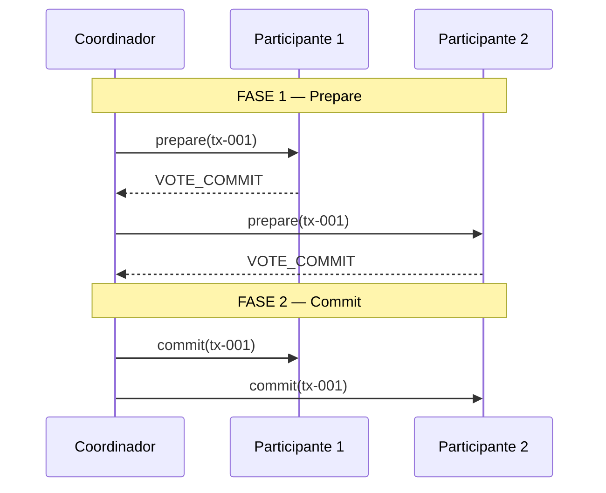
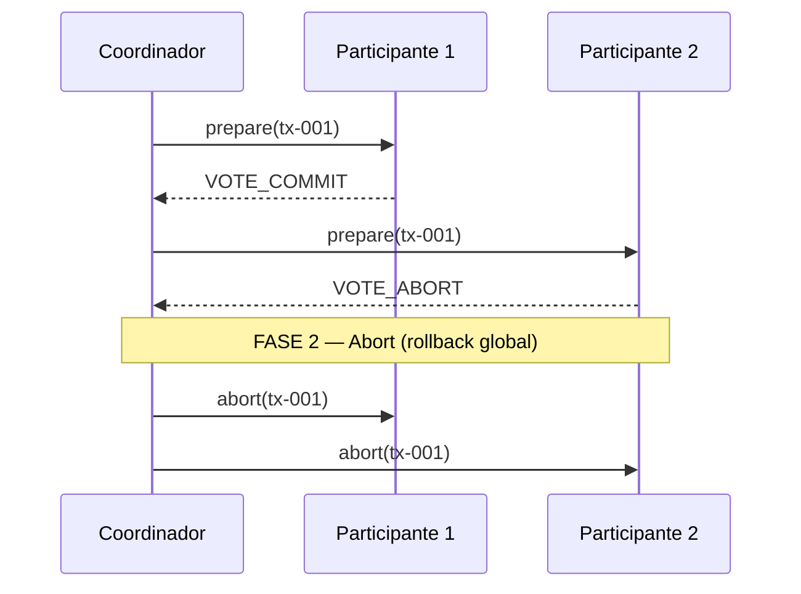

# 3. Protocolo de dos fases (2PC)

[← Transacciones](02-transacciones.md) · [Índice](README.md) · [Siguiente: Roles →](04-roles-coordinador-participante.md)

## Idea general

**Two-Phase Commit** significa **compromiso en dos fases**. Un **coordinador** pregunta a todos los **participantes** y luego da una orden final que todos deben obedecer.

Es como un director de orquesta:

1. **Fase 1 — Preparación:** pregunta a cada músico "¿estás listo?"
2. **Fase 2 — Decisión:** si todos dijeron que sí, da la señal de empezar; si alguien dijo que no, cancela el concierto.

## Fase 1: Prepare (preparar)

El coordinador envía a cada participante: *"¿Puedes confirmar la transacción X?"*

Cada participante:

1. Comprueba si puede hacer su parte (en este proyecto, intenta guardar un registro en su base de datos).
2. Responde con un **voto**:
   - `VOTE_COMMIT` — "sí, estoy listo"
   - `VOTE_ABORT` — "no puedo"

Si **un solo participante** vota abort o no responde, el coordinador sabe que **no** puede confirmar globalmente.

```
Coordinador ──prepare──► Participante 1 ──► VOTE_COMMIT
Coordinador ──prepare──► Participante 2 ──► VOTE_COMMIT
```

## Fase 2: Commit o Abort (confirmar o cancelar)

Según los votos de la fase 1:

| Resultado fase 1 | Orden del coordinador | Qué hace cada participante |
|------------------|----------------------|----------------------------|
| Todos votaron COMMIT | `commit` | Marca la transacción como confirmada |
| Alguien votó ABORT o hubo error | `abort` | Marca la transacción como cancelada |

```
Coordinador ──commit──► Participante 1
Coordinador ──commit──► Participante 2
```

o bien:

```
Coordinador ──abort──► Participante 1
Coordinador ──abort──► Participante 2
```

## Diagrama completo



## Caso en que algo sale mal

Si el participante 2 no puede prepararse:



Así se evita que solo el participante 1 quede confirmado mientras el 2 no.

## Ventajas y limitaciones (sin tecnicismos)

**Ventajas:**

- Fácil de entender.
- Garantiza que todos confirman o todos cancelan (si la red y los nodos responden).

**Limitaciones de esta implementación educativa:**

- Si el coordinador se cae en medio del proceso, los participantes pueden quedar esperando.
- No hay reintentos automáticos ni recuperación tras fallos graves.
- En producción se usan protocolos más robustos (Saga, 3PC, consenso Raft, etc.).

Para aprender el concepto básico de acuerdo distribuido, 2PC es un excelente punto de partida.

---

[Siguiente: Coordinador y participante →](04-roles-coordinador-participante.md)
